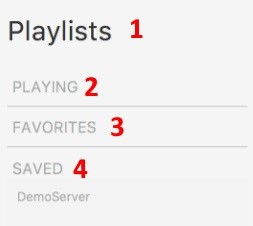
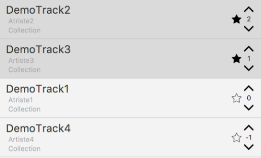
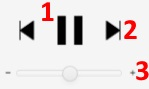

<!---
  Quelques commandes utiles:

  1. Pour compiler le document, il faut que vous ayiez installé Pandoc et XeLaTeX (ou XeTeX).
      La commande pour compiler le document est la suivate:

      pandoc --latex-engine=xelatex --listings Rapport.md -o Rapport.pdf

  2. Afin qu'une image soit correctement placée dans le document, la commande Markdown utilisée jusqu'à maintenant n'est plus d'actualité.
      Il faut maintenant utiliser la syntaxe suivante:

      \begin{figure}
        \includegraphics{<url local de l'image>}
        \caption{<Légende>}
      \end{figure}
-->

---
lang: fr

numbersections: true

papersize: a4

geometry: margin=2cm

header-includes:
    - \usepackage{etoolbox}
    - \usepackage{fancyhdr}
    - \usepackage[T1]{fontenc}
    - \usepackage{xcolor}
    - \usepackage{graphicx}
    - \usepackage{tikz}
    - \usepackage{hyperref}
    - \usepackage{floatrow}

    # Some beautiful colors.
    - \definecolor{pblue}{rgb}{0.13, 0.13, 1.0}
    - \definecolor{pgray}{rgb}{0.46, 0.45, 0.48}
    - \definecolor{pgreen}{rgb}{0.0, 0.5, 0.0}
    - \definecolor{pred}{rgb}{0.9, 0.0, 0.0}

    - \renewcommand{\ttdefault}{pcr}

    # 'fancyhdr' settings.
    - \pagestyle{fancy}
    - \fancyhead[CO,CE]{}
    - \fancyhead[LO,LE]{Commusica}
    - \fancyhead[RO,RE]{HEIG-VD - PRO 2017}

    # Redefine TOC style.
    - \setcounter{tocdepth}{1}

    # 'listings' settings.
    - \lstset{breaklines = true}
    - \lstset{backgroundcolor = \color{black!10}}
    - \lstset{basicstyle = \ttfamily}
    - \lstset{breakatwhitespace = true}
    - \lstset{columns = fixed}
    - \lstset{commentstyle = \color{pgreen}}
    - \lstset{extendedchars = true}
    - \lstset{frame = trbl}
    - \lstset{frameround = none}
    - \lstset{framesep = 2pt}
    - \lstset{keywordstyle = \bfseries}
    - \lstset{keywordsprefix = {@}}                           # Java annotations.
    - \lstset{language = Java}
    - \lstset{numbers=left,xleftmargin=2em,xrightmargin=0.25em}
    - \lstset{numberstyle = \small\ttfamily}
    - \lstset{showstringspaces = false}
    - \lstset{stringstyle = \color{pred}}
    - \lstset{tabsize = 2}

    # 'listings' not page breaking.
    - \BeforeBeginEnvironment{lstlisting}{\begin{minipage}{\textwidth}}
    - \AfterEndEnvironment{lstlisting}{\end{minipage}}

    # Set links colors
    - \hypersetup{colorlinks,citecolor=black,filecolor=black,linkcolor=black,urlcolor=black}
---
\makeatletter
\renewcommand{\@maketitle}{%
\newpage
\null
\vfil
\begingroup
\let\footnote\thanks
\begin{center}
{\LARGE\@title}\vskip1.5em
\includegraphics[width=10cm, height=10cm]{images/logo.png}\vskip1.5em
{\LARGE Manuel utilisateur}\vskip1.5em
{\large\@author}\vskip1.5em
{\large\@date}
\end{center}
\endgroup
\vfil
}
\makeatother

\title{Commusica\\Le lecteur de musique communautaire et égalitaire}

\author{Chef de projet: Ludovic Delafontaine\\
   Chef remplaçant: Lucas Elisei\\
   Membres: David Truan, Denise Gemesio, Thibaut Togue, Yosra Harbaoui\\
   Responsable du cours: René Rentsch}

\date{HEIG-VD - Semestre d'été 2017}

\maketitle

\begin{tikzpicture}[remember picture,overlay]
   \node[anchor=north east,inner sep=0.25cm] at (current page.north east)
              {\includegraphics[width=5cm]{images/heig-vd.png}};
\end{tikzpicture}

\newpage

\newpage

\tableofcontents

\listoffigures

\newpage

# Introduction
Ce document est le manuel d'utilisation de l'application **Commusica** développée dans le cadre d'un projet de semestre de la section TIC de la HEIG-VD.

**Commusica** est une application permettant aux utilisateurs d'envoyer des fichiers musicaux à un autre utilisateurs qui se sera préalablement configuré comme serveur. La communication se fait via un réseau local sans fil ou câblé.
Son intêret et de proposer une expérience communautaire en permettant à tous les utilisateurs de changer l'ordre de la liste de lecture en cours en votant pour ou contre les morceaux s'y trouvant. Ces derniers vont alors changer d'ordre. Le contrôle du volume, de l'arrêt/mise en marche du morceau en cours et du passage au morceau suivant, fonctionnent sur un principe de vote et sont effectuer lorsqu'une majorités des utilisateurs actifs d'un serveur ont voté pour réaliser l'action.

Version de Commusica: 1.0

Version du manuel utilisateur: 1.0

# Prérequis
## Système d'exploitation et logiciels
**Commusica** a été testé sur les systèmes suivants et peut donc être utilisé sur:
- Windows 10
- Mac OS 10.11.6

et nécessite au minimum la version 8 de Java, téléchargeable sur leur site [oracle.com/technetwork/java/javase/downloads](oracle.com/technetwork/java/javase/downloads)

## Infrastructure
Pour une configuration en tant que serveur, il faut prévoir suffisamment d'espace de stockage pour recevoir les fichiers audio temporaire. Cela peut donc varier selon l'usage mais il est préférable de prévoir 1Go d'espace libre.

De plus, il est nécessaire d'avoir un système qui puisse diffuser de la musique afin que l'application marche.

# Lancement
Les étapes suivantes vont vous permettre de lancer l'application.

Commencez par récupérer la dernière version de **Commusica** puis enregistrez la sur le disque dur.

Assurez vous d'avoir les deux fichiers suivants pour le bon fonctionnement de **Commusica**:
- `commusica-1.0.jar`
- `commusica-1.0.properties`

Il est nécessaire de savoir où est situé le fichier de **Commusica**, nommé par défaut `commusica-1.0.jar`.

## Windows
- Double-cliquer sur le fichier `commusica-1.0.jar`
- Le programme devrait se lancer

Si cela ne marche pas,
- Ouvrir PowerShell depuis le menu Démarrer
- Se déplacer à l'endroit où est sauvegardé le fichier `commusia-1.0.jar`
- Taper la commande `java -jar commusica-1.0.jar`
- Appuyer sur `Enter`
- Le programme devrait se lancer

## Mac OS
- Ouvrir le Terminal
- Se déplacer à l'endroit où est sauvegardé le fichier `commusia-1.0.jar`
- Taper la commande `java -jar commusica-1.0.jar`
- Appuyer sur `Enter`
- Le programme devrait se lancer

# Utilisation
Les étapes suivants vous explique comment utiliser l'application.

## Choix du lancement de l'application
Une fois l'application lancée, la fenêtre ci-dessous apparaît.

En cliquant sur `Cancel`, vous quittez l'application.

Vous avez le choix de lancer l'application en tant que Serveur ou Client.

- Serveur: Réceptionnera la musique et la lira sur le système audio.
- Client: Peut envoyer de la musique au serveur ou interagir avec.

## Interface commune
Les explications suivantes sont communes aux deux façons de lancer l'application, soit en tant que serveur, soit en tant que client

### Choix de l'interface réseau
Le panneau `Settings` vous offre la possibilité de choisir l'interface réseau à utiliser parmi les interfaces que votre ordinateur met à disposition. Une interface par défaut est mise à paramètrée mais il se peut que les clients ne puisse pas vous detecter dans le cas ou celle par défaut n'est pas connectée au réseau. Dans ce cas choisissez la bonne interface (sur **Windows** elle se nommera la plupart du temps *wlan...*).  
    **Si la connexion fonctionne ne touchez pas cette option.**
    
    

### Choix des listes de lecture et favoris
Ce panneau vous permet de naviguer entre la playlist actuelle, vos morceaux enregistrés en temps que favoris et les différentes playlists que vous avez hébergé sur votre ordinateur.
  

1. Le panneau `Playlists` contient toutes les listes de lectures.
2. La playlist en cours de lecture  
3. La liste des palylists sauvegardées des utilisations précédentes
4. Les playlsits préférées des utilisations précédentes.

### Liste de lecture du serveur
Les chansons présentes actuellement dans la playlist en cours de lecture.  
  

#### Réorganiser la liste de lecture   
Vous avez maintenant une vue sur la liste de lecture du serveur. Vous pouvez, ainsi, voter pour ou contre une ou plusieurs chansons sauf la chanson en cours de lecture. Plus le nombre total de votes est grand, plus la chanson aura plus de chance d'être joué après la chanson en cours de lecture.
**Les chansons, dans la liste de lecture, sont organisées par ordre décroissant: les chansons ayant le plus grand nombre de votes sont placées en haut de la liste. **

 Vous pouvez favoriser une chanson en cliquant sur cette étoile.

### Contrôle de la musique
  
Si vous voulez passer à la chanson suivante, vous pouvez cliquer sur ce bouton. La chanson suivante sera jouée si la mojorité des présents le demande.  
Si vous voulez augmenter ou diminuer le volume, vous pouvez cliquer sur ce bouton. Le volume sera modifié si la mojorité des présents le demande.  

### Musique précédente  
Les informations concernant la chanson précédent la chanson en cours de lecture.

## Serveur
Les explications suivantes concernent le lancement de l'application en tant que serveur.

### Configuration du serveur
Quand vous choisissez de lancer l'application en tant que serveur, une fênetre apparaîtera pour vous demander de nommer votre serveur.
.

Vous pouvez ensuite choisir votre interface réseau comme expliqué ci-dessous dans le paragraphe `Choix de l'interface réseau`.

## Client
Les explications suivantes concernent le lancement de l'application en tant que client.

### Choix du serveur

Quand vous choisissez de lancer l'application en tant que client, vous aurez le choix de vous connecter à un des serveurs. Vous pourriez choisir parmi une liste de serveurs disonibles.

