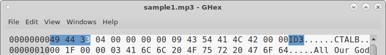
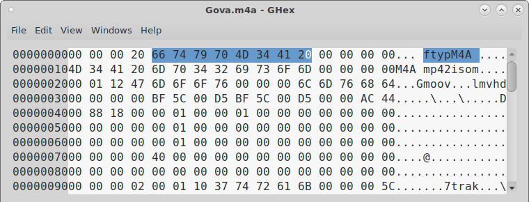
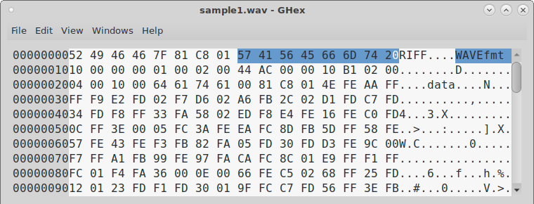

<!---
  Quelques commandes utiles:

  1. Pour compiler le document, il faut que vous ayiez installé Pandoc et XeLaTeX (ou XeTeX).
      La commande pour compiler le document est la suivate:

      pandoc --latex-engine=xelatex --listings Rapport.md -o Rapport.pdf


  2. Afin qu'une image soit correctement placée dans le document, la commande Markdown utilisée jusqu'à maintenant n'est plus d'actualité.
      Il faut maintenant utiliser la syntaxe suivante:

      \befin{figure}
        \includegraphics{<url local de l'image>}
        \caption{<Légende>}
      \end{figure}
-->

---
lang: fr

numbersections: true

papersize: a4

geometry: margin=2cm

header-includes:
    - \usepackage{etoolbox}
    - \usepackage{fancyhdr}
    - \usepackage[T1]{fontenc}
    - \usepackage{xcolor}
    - \usepackage{graphicx}
    - \usepackage{tikz}
    - \usepackage{hyperref}
    - \usepackage{floatrow}

    # Some beautiful colors.
    - \definecolor{pblue}{rgb}{0.13, 0.13, 1.0}
    - \definecolor{pgray}{rgb}{0.46, 0.45, 0.48}
    - \definecolor{pgreen}{rgb}{0.0, 0.5, 0.0}
    - \definecolor{pred}{rgb}{0.9, 0.0, 0.0}

    - \renewcommand{\ttdefault}{pcr}

    # 'fancyhdr' settings.
    - \pagestyle{fancy}
    - \fancyhead[CO,CE]{}
    - \fancyhead[LO,LE]{Commusica}
    - \fancyhead[RO,RE]{HEIG-VD - PRO 2017}

    # Redefine TOC style.
    - \setcounter{tocdepth}{2}

    # 'listings' settings.
    - \lstset{breaklines = true}
    - \lstset{backgroundcolor = \color{black!10}}
    - \lstset{basicstyle = \ttfamily}
    - \lstset{breakatwhitespace = true}
    - \lstset{columns = fixed}
    - \lstset{commentstyle = \color{pgreen}}
    - \lstset{extendedchars = true}
    - \lstset{frame = trbl}
    - \lstset{frameround = none}
    - \lstset{framesep = 2pt}
    - \lstset{keywordstyle = \bfseries}
    - \lstset{keywordsprefix = {@}}                           # Java annotations.
    - \lstset{language = Java}
    - \lstset{numbers=left,xleftmargin=2em,xrightmargin=0.25em}
    - \lstset{numberstyle = \small\ttfamily}
    - \lstset{showstringspaces = false}
    - \lstset{stringstyle = \color{pred}}
    - \lstset{tabsize = 2}

    # 'listings' not page breaking.
    - \BeforeBeginEnvironment{lstlisting}{\begin{minipage}{\textwidth}}
    - \AfterEndEnvironment{lstlisting}{\end{minipage}}

    # Set links colors
    - \hypersetup{colorlinks,citecolor=black,filecolor=black,linkcolor=black,urlcolor=black}
---
\makeatletter
\renewcommand{\@maketitle}{%
\newpage
\null
\vfil
\begingroup
\let\footnote\thanks
\begin{center}
{\LARGE\@title}\vskip1.5em
\includegraphics[width=10cm, height=10cm]{images/logo.png}\vskip1.5em
{\LARGE Rapport final}\vskip1.5em
{\large\@author}\vskip1.5em
{\large\@date}
\end{center}
\endgroup
\vfil
}
\makeatother

\title{Commusica\\Le lecteur de musique communautaire et égalitaire}

\author{Chef de projet: Ludovic Delafontaine\\
   Chef adjoint: Lucas Elisei\\
   Membres: David Truan, Denise Gemesio, Thibaut Togue, Yosra Harbaoui\\
   Responsable du cours: René Rentsch}

\date{HEIG-VD - Semestre d'été 2017}

\maketitle

\begin{tikzpicture}[remember picture,overlay]
   \node[anchor=north east,inner sep=0.25cm] at (current page.north east)
              {\includegraphics[width=5cm]{images/heig-vd.png}};
\end{tikzpicture}

\newpage

\newpage

\tableofcontents

\listoffigures

\listoftables

\newpage

# Introduction
Durant le quatrième semestre de la section TIC de l'HEIG-VD, nous devons effectuer un projet par groupes de cinq ou six personnes. Le but est de mettre en oeuvre les connaissances que nous avons acquises au long des semestres précédents à travers un projet conséquent. Nous devrons prendre conscience des difficultés liées au travail de groupe, ainsi qu'apprendre à planifier un travail sur plusieurs mois. Au terme du semestre, nous devons rendre un programme complet et fonctionnel, avec une documentation adéquate et être capables de le présenter et le défendre.

Dans le cadre du projet, l'équipe de programmation est composée du chef d'équipe Ludovic Delafontaine, de son remplaçant Lucas Elisei et des membres David Truan, Thibaut Togue, Yosra Harbaoui et Denise Gemesio.

Dans ce rapport, nous allons expliquer notre démarche de travail et les principaux choix d'architecture et de design de code. Il sera structuré selon les principaux paquets de notre application.

# Objectif
Le but de notre programme est de proposer une application client-serveur qui permettra aux clients d'envoyer des fichiers musicaux au serveur pour que celui-ci les joue. Il se démarque d'une simple application de lecture en continu (streaming) dans le fait que la liste de lecture ne peut être changée que par les clients, par le biais d'un système de votes positifs ou négatifs. Ceux-ci permettent à un morceau d'être placé plus en avant ou en arrière dans la liste de lecture. Cela permet donc à chacun de donner son avis, tout en centralisant la lecture de la musique sur un seul ordinateur. De plus, l'application met à disposition les fonctionnalités suivantes pour une expérience encore plus communautaire:

- Passer au morceau suivant si la majorité le souhaite. Cela aura pour effet de récupérer la musique suivante la plus demandée et de la lire.
- Augmenter et diminuer le volume si la majorité le souhaite.
- Système de favoris pour permettre aux utilisateurs de sauvegarder les informations d'une chanson pour pouvoir la retrouver par la suite.

On souhaite répondre à l'éternel problème de devoir se partager une prise jack ou de devoir se battre pour pouvoir passer un morceau que l'on souhaite écouter.

# Public cible
Cette application visera un public dont la gestion de la musique lors d'un événement est critique.
Cela peut autant concerner les lieux publics tels que les bars ou encore les événements privés, tels que les soirées entre amis.

Notre application se voudra donc simple à utiliser, afin qu'un néophyte dans le domaine de l'informatique puisse l'utiliser.

# Conception et normes
Avant de se lancer dans le développement, nous avons pris le temps de réfléchir à l'architecture de notre programme. Nous avons souhaité séparer au mieux les différentes entités de notre application, afin de simplifier le développement, la compréhension du programme et rester très abstraits.

Nous avons donc pris trois semaines, avant de commencer le développement, afin de définir l'architecture du programme décrite ci-dessous.

Une fois l'architecture bien définie, nous avons déterminé des normes de développement afin d'utiliser toutes et tous la même façon de coder. Parmi les points discutés, nous avons abouti aux conventions suivantes :

- Langue de documentation : la langue véhiculaire de l'informatique étant l'anglais, il était évident que le développement allait se faire dans cette langue. C'est la raison pour laquelle notre code, ainsi que la JavaDoc, sont écrits en anglais.
- Utilisation de la JavaDoc pour la génération future d'une documentation technique.
- Définition de la syntaxe à utiliser pour les variables, constantes et autres structures syntaxiques.

# Architecture

{height=200px}

## Entité base de données
Cette entité est une abstraction de la base de données. Elle permet de simplifier l'interaction avec cette dernière en mettant à disposition des méthodes pour les opérations de base sur la base de données.

Cette entité permet, par exemple, à un utilisateur de sauvegarder les métadonnées des chansons qui lui plaisent dans la base de données.

Les différentes tables sont générées automatiquement par Hibernate (voir `Technlogies utilisées` et la corrélation entre les classes Java et la base de données est définie dans les fichiers `.hbm.xml` dans le dossier `ressources/models`), ce qui permet de séparer les deux notions: programmation orientées objet et base de données.

## Entité système de fichiers
Cette entité a pour rôle d'assurer la gestion des fichiers en interagissant avec le système de fichiers. Elle permet de sauvegarder, supprimer, renommer des fichiers sur le disque, recevoir des fichiers par le réseau et vérifier qu'ils ne soient pas corrompus.

## Entité réseau
Cette entité permet toute la gestion du réseau entre les clients et le serveur. Elle permet de répondre aux attentes suivantes :

- Le serveur doit pouvoir gérer plusieurs clients, mais sans devoir garder une connexion constante entre chaque client et le serveur.
- Un serveur ou un client doivent pouvoir communiquer l'un avec l'autre en utilisant une liaison de communication "privée" à l'aide de l'Unicast.
- Un serveur doit pouvoir diffuser à tous les clients un message afin que tout le monde le réceptionne et le traite à l'aide du Multicast.

## Entité sessions
Cette entité permet de gérer des notions de sessions afin de connaître les personnes connectées et les serveurs accessibles. Il y a notamment deux notions de session : les sessions serveur et les sessions utilisateur.

Dans le cas des sessions serveur, le but est de savoir si un serveur est encore accessible. A chaque mise à jour de la part du (des) serveur(s), la session associée sera mise à jour. Si un des serveurs venait à être éteint ou déconnecté, le client supprimerait le serveur afin qu'il ne tente pas d'y accéder.

Dans le cas des sessions utilisateur, le but est de pouvoir limiter un utilisateur dans son nombre d'actions sur le serveur - voter pour un morceau, voter contre un morceau, faire une demande de changement de musique, etc. - et savoir combien d'utilisateurs sont actifs sur le serveur afin de savoir quand une action définie par une majorité doit avoir lieu.

## Entité médias
Cette entité regroupe tout ce qui concerne les médias de notre application : chansons, listes de lecture, lecteur de musique.

## Entité contrôleur
Cette entité permet le contrôle de l'application. C'est elle qui va gérer le comportement de l'application et faire la liaison, le mieux possible, entre toutes les entités décrites ci-dessus ainsi que répondre aux demandes des utilisateurs et des serveurs.

## Entité visuelle
L'entité visuelle est ce que l'on va montrer à l'utilisateur afin qu'il ait une interface pour intéragir avec le programme. Cette interface sera liée directement au contrôleur, qui saura quoi faire en fonction de l'action demandée.

## Entités utilitaires
Ces entités sont celles qui ne trouvent pas leur place dans des entités spécifique. L'entité de configuration qui permet de récupérer des propriétés d'un fichier de configuration fait notamment partie de ces entités utilitaires.

# Description technique
La description technique se développera dans l'ordre croissant de complexité des différentes entités de notre programme.

Pour chacune des paquets, dérivés des entitées décrites ci-dessus, nous décrirons brièvement le but des différentes classes.

## Paquet database

{ height=200px }

Ce paquet est constitué essentiellement de la classe `DatabaseManager` dont le rôle est d'assurer les méthodes définies par les notions CRUD (Create, Read, Update, Delete) de la base de données de notre application et d'assurer la fermeture de la connexion à celle-ci.

Hibernate est la librairie utilisée dans notre projet afin de pouvoir communiquer avec la base de données. Elle utilise un système de Session afin de garder en cache les différentes informations de la base de données. Avant d'enregistrer sur la base de données, Hibernate va interroger son cache afin de savoir si l'information est disponible et s'il est nécessaire de faire une quelconque action sur la base de données réelles.

## Paquet file

{ height=200px }

Le paquet `file` est constitué de deux classes: `FileManager` et `FilesFormats`.

### `FilesFormats`
Actuellement, notre application supporte trois formats de fichiers audio: MP3, M4A et WAV. La classe permet de définir les caractéristiques d'un fichier, c'est-à-dire, tous les éléments nous permettant de connaître le type du fichier.

### `FileManager`
Cette classe permet de supprimer, stocker et déterminer le type de fichier.
Pour retrouver l'extension du fichier, nous avons procédé de la manière suivante :

- Pour les fichiers MP3, nous regardons les trois premiers octets depuis le début du fichier.
- Pour les M4A, nous regardons les premiers octets en partant du quatrième octet depuis le début du fichier.
- Pour les WAV, à partir du huitième octet depuis le début du fichier.







Connaître le type de fichier nous permettra de traiter uniquement les fichiers supportés pas notre plateforme et, aussi, en termes de sécurité, éviter qu'un utilisateur ne fasse planter le serveur en envoyant un fichier qui n'est pas supporté par celui-ci.

## Paquet network


Pour répondre aux besoin architecturaux vus plus haut, nous avons développé plusieurs classes qui s'occupent de gérer les sockets et envois de commande via le réseau. Nous savions que notre protocole enverrait du texte car la lecture de ligne dans un flux d'entrée se fait facilement grâce à la méthode `readline()`. Nous avions aussi besoin d'envoyer des objet sérialisés au format JSON.

### Protocole et commandes
La plupart des commandes listées ci-dessous sont disponibles dans la classe `ApplicationProtocol`, mais, comme elles sont envoyées par le réseau, nous avons préféré les expliquer ici.
Toutes les commandes envoyées par Unicast ont comme deux premiers arguments :
- L'ID de l'expéditeur, qui est le hash de l'adresse MAC de l'interface réseau qu'il utilise.
- Le socket utilisé pour la communication qui est rajouté à la réception, avant d'envoyer la commande au `Core` (la notion de `Core` est développée au chapitre `Core`).

De ce fait, les tableaux ci-dessous n'indiquent, dans leur colonne `Arguments`, que les arguments en plus de ces deux dans l'ordre dans lequel ils sont envoyés.

La seule commande envoyée en Multicast est `PLAYLIST_UPDATE`, qui est envoyée depuis le serveur à tous les client.

Les objets décrits ci-dessous sont évidemment sérialisés avant d'être transférés sur le réseau.

Commande                                                                    Arguments    But
--------------------------    -------------------------------------------------------    ----------------------------------------------------------------------------
`SEND_FIRST_CONNECTION`       Aucun                                                      Envoyée lors de sa première connexion à un serveur.
`TRACK_REQUEST`               Track à envoyer                                            Permet de savoir s'il faut envoyer le fichier ou si le système l'a déjà.
`SENDING_TRACK`               Taille du fichier à envoyer,                               Envoi du fichier en réponse à `TRACK_ACCEPTED` si accepté.
                              Track à envoyer
`PLAY_PAUSE_REQUEST`          Aucun                                                      Souhait de mettre le morceau actuel en lecture/pause.
`NEXT_TRACK_REQUEST`          Aucun                                                      Souhait de passer au morceau suivant.
`TURN_VOLUME_UP_REQUEST`      Aucun                                                      Souhait d'augmenter le volume.
`TURN_VOLUME_DOWN_REQUEST`    Aucun                                                      Souhait de baisser le volume.
`UPVOTE_TRACK_REQUEST`        ID de la Track à upvoter                                   Souhait d'upvoter un morceau de la liste de lecture.
`DOWNVOTE_TRACK_REQUEST`      ID de la Track à downvoter                                 Souhait de downvoter un morceau de la liste de lecture.
`END_OF_COMMUNICATION`        Aucun                                                      La communication doit être stoppée.
--------------------------    -------------------------------------------------------    ----------------------------------------------------------------------------
Table: Commandes envoyées par le client au serveur

Commande                                                                    Arguments    But
--------------------------    -------------------------------------------------------    ----------------------------------------------------------------------------
`PLAYLIST_UPDATE`             L'adresse du serveur,                                      Notifier tous les clients en Multicast de l'état du système.
                              le nom du serveur,
                              la liste de lecture en cours
`TRACK_ACCEPTED`              Aucun                                                      Réponse à la commande `TRACK_REQUEST` lorsque le morceau est accepté.
`TRACK_REFUSED`               Aucun                                                      Réponse à la commande `TRACK_REQUEST` lorsque le morceau est refusé.
`TRACK_SAVED`                 Aucun                                                      Réponse à `SENDING_TRACK` si le morceau a été enregistré avec succès.
`TRACK_UPVOTED`               Aucun                                                      Réponse à la commande `UPVOTE_TRACK_REQUEST` si le morceau a été upvoté.
`TRACK_DOWNVOTED`             Aucun                                                      Réponse à la commande `UPVOTE_TRACK_REQUEST` si le morceau a été downvoté.
`SUCCESS`                     Message de succès                                          Envoie un message de succès au client lors du succès d'une commande
`ERROR`                       Message d'erreur                                           Envoie un message d'erreur au client lors de l'erreur d'une commande
`END_OF_COMMUNICATION`        Aucun                                                      Commande indiquant que la communication doit être stoppée.
--------------------------    -------------------------------------------------------    ----------------------------------------------------------------------------
Table: Commandes envoyées par le serveur au client

### `Server`
Côté serveur, nous avons décidé d'opter pour une architecture avec un thread réceptionniste `Server` qui va attendre une nouvelle connexion de la part des clients. Une fois un nouveau client arrivé, il va lancer un thread `UnicastClient` qui va s'occuper de la communication avec le client. Cette communication se fait via un socket Unicast car il s'agit d'une communication privée entre le serveur et le client. Nous avons choisi cette solution car plusieurs connexions avec des clients peuvent survenir simultanément et ce système réceptionniste, avec un thread par client, gère plusieurs connexions en même temps, contrairement à un système avec un seul thread qui s'occupe d'un client à la fois.

### `UnicastClient`
La classe `UnicastClient` va pouvoir recevoir les commandes venant du réseau et en renvoyer. Elle implémente l'interface `Runnable`, ce qui lui permet de s'exécuter en tant que thread. Sa force réside dans le fait qu'elle peut être utilisée aussi bien du côté server que du côté client, grâce au fait qu'elle lit les commandes reçues et les envoie au `Core` pour qu'il les exécute.


Ce diagramme montre la lecture d'une commande venant du réseau et son découpage pour en extraire les arguments et la passer au `Core`. Celui-ci s'occupera d'exécuter la commande si elle est disponible dans l'instance de son `AbstractCore` (voir chapitre `Core`). Le `Core` renvoie ensuite une commande à envoyer en réponse à celle reçue. La communication se termine lorsque l'une des extrémités envoie la commande `END_OF_COMMUNICATION` ou qu'elle ferme son socket.

### `MulticastClient`
Cette classe implémente aussi l'interface `Runnable` dans le but de lancer son exécution dans un nouveau thread. Comme pour `UnicastClient`, cette classe peut être utilisée du côté serveur comme du côté client. La méthode `run()` permet au thread de rejoindre le groupe Multicast à l'adresse définie dans le `NetworkProtocol`. Le thread va ensuite attendre de recevoir des datagrammes venant du groupe Multicast jusqu'à son arrêt par la méthode `stop()`.

Nous avons été confrontés à un problème lors du développement, lorsque nous nous sommes rendu compte qu'un `MulticastSocket` utilisait la première interface réseau disponible sur l'ordinateur plutôt que celle qui était réellement connectée. Cela prenait énormément de temps à être résolu et nous avons donc mis à disposition un choix d'interfaces réseau dans l'interface utilisateur.

Les `Core` ont chacun un `MulticastClient` pour pouvoir envoyer la liste de lecture actuelle ainsi que les informations sur l'état du lecteur - en pause ou en lecture, état du volume, etc.).

### `NetworkProtocol`
C'est dans cette classe que sont définies les commandes spécifiques au réseau `END_OF_COMMUNICATION` et `END_OF_COMMAND`. Les ports pour les différents sockets ainsi que l'adresse du groupe Multicast se trouvent également dans cette classe. Ces derniers ont été choisis arbitrairement parmi les plages disponibles. Bien que peu probable, il est possible qu'une autre application utilise ces mêmes ports. Dans ce cas, le bon fonctionnement de **Commusica** se retrouverait corrompu. Nous n'avons pas voulu laisser ces valeurs dans le fichier de configuration car il est indispensable d'avoir les mêmes ports chez le serveur et chez les clients. Nous avons donc préféré prendre le risque qu'un autre programme utilise les mêmes ports plutôt qu'un utilisateur change ces valeurs.

### Threads lancés pour gérer la communication client-serveur
Voici les différents threads lancés par le client et le serveur.


## Paquet session


Cette entité permet de gérer la notion de session afin de connaître les personnes connectées et les serveurs accessibles.

### `ISession`
L'interface `ISession` permet de définir le fait qu'une session soit caractérisée par un identifiant et une date de dernière mise à jour. Cela est nécessaire pour la bonne exécution de certaines méthodes.

L'identifiant est toujours un ID unique `Integer` qui est généré à l'aide de l'adresse MAC de l'une des interfaces réseau du serveur/client.

La méthode `update()` permet de mettre à jour la session afin qu'elle ne soit pas nettoyée par le `ScheduledExecutorService` (voir ci-dessous).

### `ServerSession`
Cette classe représente une session serveur.

En plus de l'identifiant unique, un serveur est représenté par un nom et une adresse de destination afin de savoir comment l'atteindre.

### `UserSession`
Cette classe représente une session utilisateur. Le but est de pouvoir identifer un utilisateur unique afin d'éviter qu'il puisse faire plusieurs actions consécutives sans limite. En plus de cela, cette classe permet de savoir, par exemple, à partir de quand un changement de chanson doit être effectué - la majorité des utilisateurs doit avoir voté un changement de chanson.

### `ISessionManager`
Cette interface demande à chaque SessionManager de mettre à disposition une méthode `stop()`. En effet, chaque SessionManager démarre un `ScheduledExecutorService` dont le but est de nettoyer les sessions inactives du système, soit en les supprimant, soit en les désactivant, et ce, à intervalles réguliers définis dans le fichier de configuration.

### `ServerSessionManager`
Cette classe permet de gérer les différentes sessions des serveurs. Elle permet de stocker et savoir quels sont les serveurs actifs.

Elle est constituée d'une `Map` permettant de stocker les différents serveurs accessibles. Cette liste est mise à jour à chaque fois qu'un serveur envoie une mise à jour de sa liste de lecture à l'aide de la commande `PLAYLIST_UPDATE`.

Elle est nettoyée à l'aide du `ScheduledExecutorService` afin de supprimer de l'interface graphique les serveurs qui ne sont plus accessibles.

### `UserSessionManager`
Cette classe permet de gérer le stockage, le nettoyage ainsi que les votes des différentes sessions utilisateur. Elle permet de garder à jour deux listes qui permettent de stocker les utilisateurs actifs et inactifs. Elle a un système de mise à jour automatique à l'aide d'un `ScheduledExecutorService`. Pour ce qui est des votes, elle permet d'empêcher qu'un utilisateur ne vote plusieurs fois pour la même actions (score, pause, etc.).

## Paquet media


Ce package permet de définir tous les éléments nécessaires à la gestion de la musique au niveau de l'application.

### `EphermeralPlaylist`
La classe EphermeralPlaylist représente la liste de lecture en cours de construction, c'est-à-dire, la liste de lecture en cours de lecture. Cela permet de mettre à jour l'interface graphique lors d'une action sur un élément de la playlist. La mise à jour se fait grâce au pattern observeur, à travers la liste `ObservableSortedPlaylistTrackList`, qui joue, en même temps, le rôle d'observable et d'observeur. Elle observe des chansons de la liste dans le but de changer l'état de la liste de lecture en cas de vote positif ou négatif, et devient observable dans le cas où elle envoie des notifications lors des mises à jour. Dans cette classe, nous avons aussi le champ `delegate` qui représente la liste de lecture qui sera enregistrée dans la base de données pour le suivi de celle-ci.

### `Player`
Cette classe permet de réaliser les actions de base sur la musique telles que la lecture, la mise sur pause, passer à la musique suivante, etc.

Lors de l'implémentation, nous avions le choix entre deux paquets : `javafx.scene.media` et `javax.sound` proposant tous les deux différentes classes pour gérer des fichiers audio et les jouer. Nous avons préféré utiliser `javafx.scene.media` pour les raisons suivantes:

- Facile à implémenter
- Accepte plus de formats que `javax.sound`. Par exemple, MP3 n'est pas supporté par `javax.sound`.
- Beaucoup plus abstrait, `javax.sound` demandant de travailler directement au niveau des byes.

De plus, `javafx.scene.media` étant issu de JavaFX, que nous utilisons pour l'interface graphique, risque de mieux s'intégrer à cette dernière.

Le paquet `javafx.scene.media` propose les classes suivantes:

- `Media` media resource, contient des informations sur les médias, telles que leur source, leur résolution et leurs métadonnées.
- `MediaPlayer` est le composant clé fournissant les contrôles pour la lecture de médias.
- `MediaView` permettant de supporter l'animation, la translucidité et les effets.

Nous avons aussi utilisé, dans cette classe, les propriétés JavaFX dans le but est de mettre à jour de manière automatique l'interface utilisateur lorsqu'une modification se produit.

Une fois que `Player` a fini de la lire sa chanson, il va interroger le `PlaylistManager` qui va lui fournir la prochaine chanson à jouer, en se basant sur le nombre de votes de cette derière à l'aide du `VoteComparator`.

### `SavedPlaylist`
Cette classe est utilisée afin de stocker une `EphermeralPlaylist` dans la playlists et récupérer une ancienne playlist dans la base de données.

La différence entre les deux classes se situe dans le fait que `EphermeralPlaylist` est une playlist en cours de construction alors que la `SavedPlaylist` est le résutat final d'une `EphermeralPlaylist`.

Seule `SavedPlaylist` est stockée dans la base de données et persistante dans la vie du programme.

### `Track`
Cette classe représente une chanson, elle en regroupe toutes les informations nécessaires à une identité unique.
Nous avons implémenté trois constructeurs :

- Le constructeur vide : toutes les classes persistantes doivent avoir un constructeur par défaut pour que Hibernate puisse les instancier en utilisant le constructeur `Constructor.newInstance()`.
- `public Track(String id, String title, String artist, String album, Integer length, String uri)` : constructeur permettant de créer une instance de `Track` lorsque tous les paramètres sont connus.
- `public Track(AudioFile audioFile)` : constructeur permettant de créer une instance de `Track` à partir d'un fichier audio. Il est utile lorsque nous souhaitons transférer un fichier et effectuer un contrôle sur une chanson, au lieu de vérifier le fichier audio lui-même.

## Paquet playlist
Le paquet `playlist` met en oeuvre ce qui a trait à la gestion des playlists, dans notre cas :

- Le lien entre une certaine chanson et les playlists dans lesquelles elle se trouve.
- La sélection d'une certaine playlist.
- La gestion des votes positifs et négatifs concernant les chansons contenues dans une liste de lecture spécifique.

### `PlaylistManager`
La classe `PlaylistManager` représente un gestionnaire de playlists et a plusieurs utilités :

- Récupérer la liste de lecture en cours de création.
- Récupérer les playlists sauvegardées.
- Récupérer la liste de lecture des favoris.
- Ajouter/supprimer des chansons à la liste de lecture des favoris.
- Créer/supprimer une playlist.

### `PlaylistTrack`
La classe `PlaylistTrack` permet non seulement de représenter le lien entre une chanson et une playlist, mais aussi de connaître le nombre de votes de la chanson, ce qui sera ensuite utile au niveau de la classe `VoteComparator` qui organise les chansons dans la liste de lecture selon le nombre de votes. Cela peut être fait grâce au fait que `PlaylistTrack` met à disposition une variable `votesProperty` à laquelle un observeur a été ajouté afin que l'interface graphique se réorganise correctement.

### `PlaylistTrackId`
Cette classe permet de créer le lien entre une certaine liste de lecture et une chanson. Grâce à l'implémentation d'un hashcode, nous pouvons nous servir de celui-ci afin de vérifier que la chanson reliée à la liste de lecture n'existe pas déjà dans la base de données.

### `VoteComparator`
Le comparateur de vote ne possède qu'une fonction. Celle-ci sert tout simplement à déterminer, entre deux chansons, laquelle a le plus grand nombre de votes. Il a été créé dans le but de réorganiser la liste de lecture en commençant par les chansons les plus votées.

## Paquet utils
Le paquet `utils` réunit tous les utilitaires dont nous avons eu besoin au sein de plusieurs classes et dont l'implémentation n'avait aucun sens au sein desdites classes. L'utilité de chaque classe diffère alors énormément.

### `Configuration`
Cette classe permet la récupération des propriétés définies dans un fichier de configuration. Elle fixe le fichier de configuration à utiliser et permet l'accès à ces dernières.

Le ficher de configuration du programme utilisé dans le cadre de ce projet est `commusica.properties`. Il donne accès aux paramètres suivants :    

 +  DEBUG : permet de choisir d'afficher ou non la sortie du programme
 +  DATE_FORMAT : choix du format de la date
 +  VOLUME_STEP : choix du pas d'augmentation et abaissement de la musique
 +  TRACKS_DIRECTORY : choix du chemin relatif où les chansons seront stockées
 +  TIME_BEFORE_SESSION_INACTIVE : choix du délai d'inactivité d'une session
 +  TIME_BETWEEN_PLAYLIST_UPDATES : choix du délai de mise à jour des playlists et leurs chansons

### `Network`
Cette classe permet de récupérer toutes les informations basiques de la machine concernant le réseau. Elle va, en outre, permettre de récupérer les interfaces disponibles nécessaires à la connexion à un certain serveur et configurer le réseau pour le reste de l'application.

### `ObservableSortedPlaylistTracklist`
Cette classe permet de récupérer les informations nécessaires à l'affichage des chansons dans la liste de lecture en écoute. Cet utilitaire a été créé afin de pouvoir faciliter la récupération d'informations depuis les classes mettant en oeuvre l'interface graphique.

### `Serialize`
Grâce à la librairie Gson de Google, cette classe est utilisée dans la sérialisation (Objet Java -> JSON) et désérialisation (JSON -> Objet Java).

### `EphemeralPlaylistSerializer`
Cette classe permet de sérialiser et désérialiser une liste de lecture en JSON. L'utilité de cette classe réside principalement dans la communication réseau.

En effet, afin de pouvoir indiquer l'état de la liste de lecture éphémère aux différents

### `Logger`
Cette classe a été créée uniquement pour aider à déboguer le programme, pour comprendre ce qu'il se passe à chaque étape. Son affichage permet de savoir dans quelle classe a lieu une action. Des couleurs ont été attribuées aux différentes notifications :

- Bleu, pour les informations
- Rouge, pour les erreurs
- Vert, pour les succès
- Jaune, pour les avertissements

L'affichage des logs peut être désactivé au niveau du fichier de configuration `commusica.properties` en réglant la valeur de `DEBUG` à 0.

## Paquet core


Pour garder un niveau d'abstraction le plus élevé possible, nous avons voulu faire transiter, à travers un contrôleur, toutes les informations venant du réseau et des utilisateurs, le but étant d'avoir le même point d'entrée que l'on soit client ou serveur. Pour cela, il nous fallait un contrôleur central qui puisse être appelé de la même façon, quel que soit le choix de l'identité. C'est alors à celui-ci de vérifier l'existence d'une fonction et de communiquer l'action à exécuter à l'entité concernée. Pour résoudre ce problème, notre raisonnement nous a mené à nous tourner vers la réflexivité offerte par Java. Ce mécanisme permet d'instancier des méthodes à l'exécution en utilisant la méthode `invoke(Object obj, Object... args)` ayant comme premier paramètre un String représentant le nom de la méthode à invoquer et comme deuxième paramètre un tableau d'`Object` contentant les différents arguments dont la méthode invoquée a besoin (voir utilisation dans notre programme**FIGURE**).

Il nous fallait maintenant une classe qui puisse jouer le rôle du contrôleur. Pour cela, nous avons développé les `Core`, qui se trouvent tous dans le paquet `core`.

### `Core`
C'est une classe statique qui joue le rôle de point d'entrée. Elle dispose d'un attribut `AbstractCore` qui sera instancié soit en `ClientCore`, soit en `ServerCore`. Elle met aussi à disposition des méthodes statiques qui seront atteignables depuis les autres classes du programme.

En plus des méthodes lui permettant de se paramétrer comme client ou serveur, la plus importante est la suivante:  

```java
public static String execute(String command, ArrayList<Object> args)
```

Cette méthode statique qui peut être appelée n'importe où dans le programme appelera la méthode du même nom de la classe `AbstractCore`, qui est décrite plus loin.
Cela permet de pouvoir exécuter des commandes quelque soit le type de Core configuré: soit serveur, soit client.

### `ICore`
C'est une interface qui définit ce qui est nécessaire au Core, à savoir des méthodes permettant d'envoyer des messages en Unicast ou en Multicast et une méthode pour arrêter le Core. Toutes les classes héritant d'`AbstractCore` doivent implémenter cette interface.

### `AbstractCore`
Cette classe abstraite met à disposition les méthodes permettant à ses sous-classes de s'exécuter correctement. Contrairement à `Core`, cette classe va utiliser la réflexivité dans sa méthode execute(), comme ceci:  

```java
public synchronized String execute(String command, ArrayList<Object> args) {

    String result = "";

    try {
        Method method = this.getClass().getMethod( command, ArrayList.class);
        result = (String) method.invoke(this, args);
    } catch (NoSuchMethodException e) {
        // Do nothing
    } catch (IllegalAccessException | InvocationTargetException e) {
        LOG.error(e);
    }

    return result;
}
```

Nous recevons une commande et un tableau correspondant aux arguments de la méthode à invoquer. Ensuite, le programme essaie de trouver la méthode ayant un nom correspondant à la commande, si elle est disponible dans l'instance de la classe. Si c'est le cas, cette dernière va l'invoquer et donc exécuter ladite méthode, sinon une exception est levée. C'est grâce à cette méthode que tout prend son sens, car on a maintenant une instance d'`AbstractCore` qui est soit `ClientCore`, soit `ServerCore` avec une seule méthode pour en appeler d'autres qui seront, elles, implémentées dans les sous-classes d'`AbstractCore`.

### `ServerCore` et `ClientCore`

Ces deux classes héritant d'`AbstractCore` et implémentant `ICore` sont les classes les plus importantes du projet. C'est ici que la majorité des actions - transfert de la musique, action à effectuer lors d'un appui sur un bouton, etc. - se fera. Lors de l'envoi des commandes, ces classes fonctionnent avec un système d'états dans lequel ces derniers peuvent être changés en recevant des commandes depuis le réseau ou depuis le code. Elles ont une forte interaction avec les classes s'occupant des échanges réseau puisque c'est ici que toutes les informations reçues depuis le réseau vont passer. Grâce à la réflexivité offerte par l'`AbstractCore`, il est donc extrêmement facile de définir de nouvelles méthodes dans ces classes. Pour cela, il faut déclarer une méthode portant le nom d'une commande.

Grâce à ces classes, nous avons réglé le problème de contrôleur central par lequel tout transitera.

### Envoi d'un fichier audio d'un client vers un serveur


## Paquet et ressources ui
Concernant l'interface graphique, nous avons utilisé la librairie JavaFX. Celle-ci nous a permis de faire usage de l'outil Scene Builder afin de développer, en premier lieu, une maquette qui s'est ensuite développée, à travers plusieurs étapes, en l'interface graphique d'aujourd'hui. Le fonctionnement de JavaFX demande à avoir deux notions qui communiquent entre elles: un ou plusieurs fichiers FXML qui définissent l'arrangement de la fenêtre et une ou plusieurs classes Java qui permettent de lancer la fenêtre et communiquer avec ses composants.
Dans un premier temps, nous avons développé un fichier FXML avec l'aide de Scene Builder. Grâce à celui-ci, nous avons pu apprendre les bons usages FXML. Nous avons ensuite créé un fichier Java depuis lequel nous étions capables lancer la fenêtre au démarrage du programme. Cependant, le code se développant et devenant de plus en plus important, nous avons pris la décision de diviser aussi bien les fichiers FXML que les fichiers Java en plusieurs classes permettant d'avoir un regard plus précis sur chaque partie de notre implémentation.
Ainsi, nous avons aujourd'hui plusieurs classes Java et plusieurs fichiers FXML qui sont reliés à leur classe principale `UIController` respectivement `main.fxml`.

La description des classes se fera selon l'ordre des vues dans l'interface graphique, en partant de la vue en haut à gauche pour finir par la vue en bas au centre. Nous allons tout d'abord commencer par la fenêtre de configuration apparaissant au lancement du programme, pour continuer avec le contrôleur. Le reste des classes sera ensuite abordé.

### `ClientServerDialog`
`ClientServerDialog` est la première fenêtre lancée par le programme. Son lancement se passe alors dans la classe principale `Commusica`. Cette fenêtre permettra tout simplement de choisir entre deux rôles : celui du serveur ou de l'utilisateur lambda.
Le choix sera communiqué au Core qui prendra connaissance de la décision, configurera le programme et exécutera le lancement de l'interface graphique appropriée.

Si l'utilisateur a choisi le rôle de serveur, une nouvelle fenêtre apparaîtra afin qu'il puisse choisir le nom du serveur. Ce dernier sera aussi utilisé comme nom de la playlist qui sera diffusée.
Après cela, la classe lancera l'`UIController`.
Dans le cas où l'utilisateur ne répond pas à la question posée dans la fenêtre de dialogue et la ferme, le programme s'arrête.

### `UIController`
`UIController` est la classe qui permet de lier le reste des classes graphiques entre elles. Elle va, en premier lieu, mettre à jour la partie en haut à gauche contenant les playlists et la liste de lecture sélectionnée sera par défaut celle en cours de construction.
Mise à part la configuration initiale de la fenêtre, `UIController` permet aussi toutes les actions basiques de l'interface graphique :

+  Afficher des alertes
+  Obtenir la liste de lecture actuellement visualisée
+  Mettre à jour et afficher les playlists
+  Fermer la fenêtre proprement lorsque l'utilisateur décide d'arrêter le programme

`UIController` va tout simplement faire appel aux différentes classes du paquet `ui` afin de s'informer de l'état de chaque partie composant l'UI lors d'une demande depuis l'extérieur.

### `PlaylistsListView`
`PlaylistsListView` concerne la vue en haut à gauche affichant les playlists disponibles :

- **PLAYING** : la liste de lecture en cours de création
- **FAVORITES** : la liste de lecture des favoris
- **SAVED** : la liste des playlists sauvegardées d'anciens événements

Comme spécifié au chapitre précédent, la liste sélectionnée par défaut est la liste en cours de création.
Dans la classe `PlaylistsListView`, nous faisons usage d'une méthode de la classe `FXCollections` permettant d'attacher un observeur à n'importe quel objet du programme. Ainsi, nous pouvons facilement modifier l'affichage des playlists au fur et à mesure des actions faites au niveau du serveur ou du client.

### `TracksListView`
La classe `TracksListView` agit sur le panneau en haut au centre de l'interface graphique principale en le dessinant et définissant les usages basiques de celui-ci.
Cette classe permet d'afficher une liste de lecture et glisser/déposer un élément audio au sein du panneau, grâce à la méthode `initializeDragAndDrop()`. La liste de lecture est initialisée comme liste observable, ce qui fait que dès qu'un changement subvient, celle-ci se met à jour. Cependant, elle n'est pas encore peuplée par les chansons contenues dans la playlist. Cette question ainsi que celle des upvotes, downvotes et favoris sont traitées dans une autre classe implémentée spécialement pour cet usage : `PlaylistTrackCell`.

La méthode `initializeDragAndDrop()` de la classe `TracksListView` mérite une explication plus détaillée. Nous avons longtemps réfléchi à la meilleure façon d'implémenter le téléchargement d'une chanson. Le "drag and drop" (glisser/déposer) nous a finalement semblé être la technique la plus intuitive d'ajout de chansons.
Cette méthode, relativement complexe, nous permet donc de déterminer quand une personne a déposé un fichier dans le panneau et ce, grâce à la méthode JavaFX `setOnDragDropped()` de la classe `TransferMode`. C'est alors que nous allons faire usage du constructeur de la classe `Track` prenant en paramètre un `AudioFile`.
Si c'est le serveur qui a glissé/déposé une chanson, alors la méthode appellera directement la méthode du `PlaylistManager` permettant d'ajouter une chanson.
Dans le cas du client, la méthode passera d'abord par la classe `Core` à laquelle il enverra la commande `SEND_TRACK_REQUEST` avec comme argument la chanson sérialisée en JSON.
Nous remarquons ici, encore une fois, l'intérêt et l'importance de la classe `Core`.

### `PlaylistTrackCell`
`PlaylistTrackCell` est une classe utilisée dans chaque cellule de la liste centrale afin de définir les boutons d'upvote, downvote et favoris et leurs actions. Elle va également permettre de définir le titre, l'artiste, l'album et le nombre de votes d'une chanson.
Concernant les votes, deux fonctions - une pour les votes positifs et l'autre pour les votes négatifs - permettent de communiquer avec le `Core` à travers des commandes. Les commandes - `SEND_DOWNVOTE_TRACK_REQUEST` et `SEND_UPVOTE_TRACK_REQUEST` - sont utilisées dans ces deux cas spécifiques car l'incidence qu'aura un vote sera globale à tous les participants. Ainsi, le `Core` doit être averti du fait que l'événement a eu lieu pour en informer le serveur afin qu'il renvoie l'information à tout le monde. Encore une fois, le `Core` use de son pouvoir de messager à travers le programme.
Dans le cas des favoris, il n'y a nul besoin de passer par le `Core` car tout ce que l'utilisateur veut, c'est enregistrer l'information dans sa liste personnelle de chansons favorites.

### `SettingsView`
**DG : TODO**
*En haut à droite*

### `PreviousTrackView`
Dans le panneau en bas à gauche, nous pouvons apercevoir un espace réservé à la chanson qui vient de se terminer. Ce panneau nous a semblé utile de par le fait que, souvent, nous nous sommes personnellement retrouvés à vouloir noter le nom d'une chanson que nous venions d'écouter et, le temps de prendre notre téléphone pour identifier ladite chanson, celle-ci avait eu le temps de se terminer. Ainsi, ce panneau offre la possibilité à tous les utilisateurs de retrouver facilement et sauvegarder en un seul "clic" les informations d'une chanson.
Pour ce panneau, nous n'avons pas repris le même type de cellule que dans le panneau central du haut, car il n'y a pas de sens au fait de pouvoir upvoter ou downvoter une chanson déjà écoutée. C'est pourquoi, nous avons créé un panneau sur mesure contenant uniquement l'étoile des favoris et permettant ainsi uniquement d'ajouter la chanson à sa liste de chansons favorites.

### `CurrentTrackView`
Dans le panneau du bas, au milieu, nous pouvons apercevoir le résumé de la chanson actuellement en écoute. Les boutons ainsi que les informations sont exactement les mêmes que dans le cas de la dernière chanson grisée, affichée dans la liste de lecture du panneau en haut au centre.
Nous avons choisi cet affichage de façon à pouvoir faciliter l'accès à la chanson actuelle dans le cas où l'utilisateur aurait décidé de faire défiler la liste de lecture et aurait perdu de vue la chanson actuelle.
Le vrai défi de cette classe a cependant été celui de pouvoir remplir la jauge d'écoute selon l'avancement de la chanson. Cela a évidemment été fait à travers un observeur sur l'instance de `Player` qui possède l'information sur le temps écoulé.
Sur la gauche du panneau central, nous pouvons également apercevoir des boutons de contrôle.

#### `PlayerControlsView`
`PlayerControlsView` qui se trouve dans le même panneau que `CurrentTrackView`représente les boutons "play/pause", "chanson suivante", "chanson précédente" et "volume". Ces quatre boutons représentent en fait cinq actions distinctes qui transiteront toutes à travers le `Core`. En effet, nous nous trouvons encore une fois face à une classe de l'interface graphique dont le `Core` est indispensable à son bon fonctionnement.
Le `Core` est en mesure de déterminer vers qui il devra tourner la demande d'action à travers l'une des commandes suivantes :

- `SEND_TURN_VOLUME_DOWN_REQUEST` : pour baisser le volume
- `SEND_TURN_VOLUME_UP_REQUEST` : pour augmenter le volume
- `SEND_NEXT_TRACK_REQUEST` : pour écouter la chanson suivante
- `SEND_PREVIOUS_TRACK_REQUEST` : pour écouter la chanson précédente
- `SEND_PLAY_PAUSE_REQUEST` : pour arrêter ou démarrer la musique

Dans ces cas précis, c'est la classe `UserSessionManager`qui sera concernée par la commande.
Finalement, nous voyons dans cette classe encore une trace de ce que nous avions initialement implémenté. En effet, comme dans tous controleurs de musique, les boutons play/pause, chanson suivante et chanson précédente sont toujours présents. Cependant, dans le concept que nous visions à créer, nous n'avons jamais voulu permettre aux utilisateurs de revenir en arrière mais bien de se trouver dans un flux continu de musique.

### Fichiers FXML
Le fichier FXML de base, tout comme le fichier Java de base, a été découpé en plusieurs fichiers afin de comprendre plus facilement l'implémentation et la modifier.
Comme dans les fichiers Java, nous avons un fichier principal, `main.fxml`, qui permet de découper l'interface principale en plusieurs panneaux. Ensuite, pour chacun des panneaux, nous avons des fichiers portant le même nom que leurs classes Java.
Nous avons dû ajouter aux fichiers FXML un ID à chaque structure dont les actions nous intéressaient, et, pour certaines, nous avons également dû lier une action à une certaine méthode. Ainsi, dès l'instant que, dans le code Java, nous rencontrons un `@FXML`, cela veut dire que nous avons un lien direct avec les structures des fichiers FXML.

# Technologies utilisées

## Singleton
Comme expliqué précédemment, nous avons implémenté une partie de nos classes comme étant des Singleton. Ce patron de conception fait qu'une classe n'a qu'une seule instance.  
Voici un exemple avec la classe `FileManager`:

```
private static FileManager instance = null;

private FileManager() {}

public static FileManager getInstance() {

    if (instance == null) {
        synchronized (FileManager.class) {
            if (instance == null) {
                instance = new FileManager();
            }
        }
    }

    return instance;
}
```

Ce patron de conception est simple à mettre en œuvre avec une variable d'instance de la classe, une constructeur privé et une méthode `getInstance()` renvoyant l'instance de la classe. Il est particulièrement adapté à toutes nos classes de type `Manager` car il ne doit y avoir qu'une seule instance de celle-ci par programme.

## Réflexion
La réflexion offerte par Java a été utilisée dans le cadre des Core afin de pouvoir déterminer, lors de l'exécution, si une méthode était implémentée et pouvait être appelée. Cela a permis d'éviter la redondance de code entre un Core côté serveur et un Core côté client et n'implémenter que les méthodes qui devaient être gérées par l'une ou l'autre de ces entités.

## ThreadPool
`ThreadPool` est un outil offert par Java permettant de définir un objet `ExecutorService` mettant à disposition un nombre de threads défini par le programmeur. Il suffit ensuite de lui soumettre des objets instance de la classe `Thread` pour qu'il les lance automatiquement selon la disponibilité de son *pool*. Cela permet donc de limiter le nombre de threads lancés simultanément.  
Voici un exemple d'une utilisation pour le lancement d'un nouveau thread lors d'une connexion d'un client sur le socket du serveur:  

```
Socket clientSocket = socket.accept();

Thread client = new Thread(new UnicastClient(clientSocket));
threadPool.submit(client);
```

## ScheduledExecutorService
Sous-classe de `ExecutorService`, cette classe permet l'exécution d'un bloc de code à une fréquence définie par le programmeur. Nous l'avons utilisée pour toutes les tâches, comme l'envoi de la liste de lecture ou la suppression de sessions utilisateurs obsolètes.  

Exemple de l'envoi de la liste de lecture toutes les `TIME_BEFORE_PLAYLIST_UPDATE` secondes:  

```
broadcastPlaylist = Executors.newScheduledThreadPool(1);
broadcastPlaylist.scheduleAtFixedRate(() -> {
    execute(ApplicationProtocol.SEND_PLAYLIST_UPDATE, null);
}, 0, TIME_BEFORE_PLAYLIST_UPDATE, TimeUnit.SECONDS);
```

## Gson
Gson est une librairie développée par Google permettant la sérialisation et la désérialisation d'objets en JSON. Nous l'avons utilisé principalement pour envoyer les différents objets à travers le réseau.

## Hibernate
Hibernate est un outil ORM (Object Relational Mapping) qui simplifie la création et l'interaction avec la base de données. Il offre la possibilité de créer automatiquement les tables de la base de données en se basant sur les objets Java. Il n'est donc pas nécessaire de les créer manuellement et il gère la sauvegarde, l'intégrité de la base de données par lui-même.

Nous l'avons utilisé afin de pouvoir nous concentrer sur le code et lui déléguer la gestion de la base de données.

## JavaFX
JavaFX est une bibliothèque Java permettant la création d'applications de bureau. Les applications écrites à l'aide de cette bibliothèque peuvent fonctionner sur plusieurs plateformes. Par rapport à Swing, JavaFX nous offre:

- Les styles CSS, qui nous ont permis de styliser notre application
- La séparation de l'interface et du code

Le point majeur qui nous a fait choisir JavaFX est la séparation facile entre le code et l'interface graphique à l'aide de fichiers (F)XML permettant de définir la structure de notre interface et ne pas polluer le code avec des concepts qui n'ont pas de sens dans celui-ci.

## JAudiotagger
JAudiotagger est une API Java pour la lecture et l'écriture des métadonnées des fichiers audio. Il supporte des formats tels que MP3, MP4, WAV, etc.

Nous l'avons utilisé dans notre projet car JavaFX ne propose pas un moyen de récupérer les métadonnées des chansons et parce que c'est la librairie à ce sujet la plus connue et adaptée à nos besoins.

## Capsule
Capsule est un outil de déploiement pour les applications Java. Une capsule est un fichier JAR exécutable unique qui contient tout ce que l'application doit avoir pour pouvoir s'exécuter.

Nous l'avons utilisé dans le but de forcer l'utilisation de l'IPv4 pour les interfaces réseaux sur les ordinateurs Macintosh qui, par défaut, préfèrent l'IPv6 et ne pouvaient donc pas communiquer avec les autres systèmes qui, eux, préfèrent l'IPv4.

Lors du lancement de notre programme, la réelle exécution de celui-ci est la suivante:

`Exécution du programme Commusica -> Lancement de Capsule -> Définition des paramètres à utiliser pour la JVM -> Lancement de Commusica avec les paramètres JVM souhaités -> Démarrage de Commusica`

## Git / GitHub
Git est un outil de gestions de versions qui permet de simplifier le développement d'une application en gérant automatiquement la fusion de code de deux auteurs différents et pouvoir avoir un historique des actions effectuées tout au long du projet.

Nous l'avons utilisé afin de permettre à chacun de développer séparemment et qu'il puisse gérer la fusion automatiquement. Nous pouvions, au besoin, effectuer des tests sans mettre en péril le reste du projet à l'aide de branches. Nous avons utilisé GitHub afin de centralisé ça sur Internet.

## IntelliJ IDEA
IntelliJ IDEA est un environnement de développement intégré, autrement dit, un ensemble d'outils destinés au développement logiciel.

Nous l'avons choisi pour les raisons suivantes:
- Intégration avec les outils de gestions de versions tel que Git.
- Une autocomplétion hors pair.
- L'analyse et inspection : il analyse en temps réel et en permanence le code, à la recherche de problèmes potentiels.
- Un déboguer simple et efficace à utiliser.

## Apache Maven
Apache Maven est un outil de gestion de projet basé sur POM (modèle d'objet de projet).

Nous l'avons utilisé dans le cadre de notre projet afin de pouvoir gérer les dépendances et la compiliation de façon unifiée au travers de tous les développeurs. Il nous a permis de définir une librairie et sa version à utiliser et ainsi, le code de tous les développeurs se basent sur les mêmes versions et utilisent la même façon de compiler pour s'assurer du bon fonctionnement du programme.

## Scene Builder
Scene builder est un outil qui permet de créer des fichiers au formats FXML via un éditeur graphique.

Nous l'avons utilisé afin de découvrir les principes de réalisation d'interfaces graphiques à l'aide de JavaFX.

## Wireshark
Wireshark est un outil essentiel pour comprendre les mécanismes de fonctionnement des protocoles de communication sur les réseaux. Il capture des paquets directement sur les interfaces réseaux du système utilisé.

Nous l'avons utilisé dans notre projet afin de vérifier que la communication réseau entre le client et le serveur et s'assurer que tout marchait comme souhaité.

## PlantUML
PlantUML est un outil gratuit et open-source qui permet la génération de schémas UML de toutes sortes (diaragrammes de classe, diagrammes de séquences, diagrammes d'activités, etc.) et ce, à l'aide de fichiers textes.

Il a été utilisé afin de pouvoir très simplement créer des schémas UML qui pouvaient être améliorés par plusieurs personnes en même temps à l'aide de Git grâce au fait que c'est simplement des fichiers textes.

# Tests réalisés
**On doit en faire des tableaux et retester toute l'application**

**DG : cette liste me semble relativement massive, on pourrait faire des sous-chapitres**
**DG : attention, certains de ces points, à cause de la tournure de phrase, sont des observations et non des tests**
**DG : j'ai déplacé certaines observations de points qui ne marchent pas dans "Problèmes subsistants"**

+ Lancement du programme avec chacun des rôles
+ Choix entre serveur et client fonctionnel
+ La liste de lecture est bien émise de la part du serveur
+ La liste des serveurs disponibles se met bien à jour côté client
+ Le client peut sélectionner et se connecter au serveur
+ Le client reçoit et met à jour sa liste de lecture en fonction de celle du serveur auquel il est connecté (IL FAUDRA TESTER AVEC PLUSIEURS SERVEURS)
+ Le client peut envoyer une chanson au serveur qui l'accepte ou la refuse (A TESTER PLUS EN DÉTAILS)
+ Le serveur reçoit la chanson et met à jour sa liste de lecture (PAS SÛR QUE ÇA SOIT MIS À JOUR DANS LA DB)
+ Le client reçoit la mise à jour de la playlist
+ Le client peut upvoter et downvoter une chanson et cette dernière se met à jour. **DG: ce qui suit fait plutôt partie du chapitre "Problèmes subsistants"** Ne marche pas côté serveur.
+ Le client peut augmenter et diminuer le volume. Ne marche pas côté serveur. **DG : "Problèmes subsistants**
+ Coté client, la base de données se met bien à jour lors de l'ajout de chansons, mais la date à laquelle elle a été jouée manque dans l'EphemeralPlaylist et donc ne se met pas à jour dans la base de données du client. **DG : "Problèmes subsistants**
+ Le bouton play/pause marche et change d'état côté client et le bouton marche côté serveur, mais dans ce dernier cas, le bouton côté client ne change pas d'état. **DG : "Problèmes subsistants**
+ La PlaylistTrack se met bien à jour dans la base de données lorsqu'une chanson a été jouée côté client.
+ Favoriser une chanson côté client l'enregistre bien dans la base de données
+ A la fermeture du programme côté client, toutes les tracks qui n'ont pas été jouées sont bien effacées de la base de données
+ A la fermeture du programme côté serveur, les tracks enregistrées sont bien effacées
+ Côté serveur, les tracks sont bien ajoutées à la base de données.

## Problèmes subsistants
+ Côté client, une chanson qui n'a pas été jouée se met au dessus des chansons qui ont déjà été jouées si elle a plus de vote que les chansons déjà jouées
+ La barre du temps est manquante au niveau du client
+ Le bouton *favoris* situé dans l'interface de contrôle ne marche pas côté client et serveur
+ Le fait de favoriser une chanson ne l'enregistre pas côté serveur (ne s'affiche pas dans la liste de lecture "Favoris")
+ Les playlists tracks associées ne sont par contre pas effacées (il doit manquer le CASCADE au niveau de la db pour que ça efface aussi)

# Améliorations envisagées

# Planification / organisation

# Conclusion

# Bilan

## Bilan du groupe

## Ludovic

## Lucas

## Denise

## David

## Thibaut

## Yosra

# Sources
- Capsule ([capsule.io](capsule.io)) - Site officiel de la librairie Capsule
- Gson ([github.com/google/gson](github.com/google/gson)) - Site officiel de la librairie Gson
- Hibernate ([hibernate.org](hibernate.org)) - Site officiel de la librairie Hibernate
- JaudioTagger ([jthink.net/jaudiotagger](jthink.net/jaudiotagger)) - Site officiel de la librairie JaudioTagger
- Java 8 API Specification ([docs.oracle.com/javase/8/docs/api](docs.oracle.com/javase/8/docs/api)) - Site officiel de la documentation pour Java 8
- Stack Overflow ([stackoverflow.com](stackoverflow.com)) - Site d'entre-aide pour la programmation

\newpage

# Annexes
## Défintition des normes de programmation
### Documentation
- La documentation des méthodes et du code sera en anglais
- La tabulation est de quatre espaces
- La longeur maximale des lignes de code est sur 120 caractères
- La notation doxygen ([doxygen.org](doxygen.org)) sera utilisée pour documenter le code, avec le caractère `@` et non `\`
- Une entête de fichier (doxygen) sera utilisée pour chaque fichier
- Utilisation de la notation camel case pour les variables et méthodes
- Les variables de types statiques sont en majuscules
- Ne pas utiliser de caractères spéciaux dans les variables et fonctions

### Entêtes
Les entêtes de fonctions et fichiers devront respecter la forme suivante:

```java
/**
 * This is a correct comment
 */
```

```java
/**
 * This is also
 * a correct comment
 */
```

```java
/**
 * As well as this one in case that the documentation is very long and have "multiple parts".
 *
 * So we leave a bit of space for a better reading experience.
 */
```

Ne pas écrire d'entêtes commme ceci:
```java
/** This comment starts at the very top...
 * ...but should has started here.
 */
```

```java
/**
 *
 * Why do we leave empty spaces before and after ? Isn't it useless ?
 *
 */
```

### Fonctions
L'entête des fonctions devra respecter la forme suivante:
```java
/**
 * Description about the method
 *
 * @param x Short description
 * @param y Short description
 *
 * @return int The multiplication of x and y
 */
public int myMethod(int x, int y) {
    return x * y;
}
```

Au sein de fonction, ne pas utiliser la forme de commentaires multi-lines:
```java
/**
 * This is a comment
 * inside a function
 */
```
car si l'on souhaite commenter une partie de la fonction, les caractères `*/` couperont la commentation de la fonction.

Utiliser la forme suivante:
```java
//! This is a multi-line comment
//! inside a function
```

Les parenthèses aux fonctions restent collées au nom de la fonction, comme en mathématiques:
```java
public int iAmACoolFunctionWithoutAnySpaces(int iHateSpaces) {
    ...
}
```

```java
...

int a = iAmACoolFunctionWithoutAnySpaces(4);

...
```

### Variables
Pour commenter des variables, on utilise la forme:
```java
//! The current volume of the application
private unsigned int volume;

//! The playlist containing all the songs
private ArrayList<Music> playlist;
```

### Entête des fichiers
L'entête des fichiers devra respecter la forme suivante:
```java
/**
 * This class is an example.
 *
 * Its description continues on multiple lines without any problem. However, if a comment is too long (max. 120
 * characters), feel free to break the comment in two lines.
 */
```

### Les instructions de branchement
Les instructions de branchement sont écrites de la façon suivante, le `_` illustrant un espace:

```java
if_(condition1_&&_condition2)_{
    ...
}_else_{
    ...
}
```

```java
while_(condition1_&&_condition2)_{
    ...
}
```

```java
switch_(condition1_&&_condition2)_{

    case_1:
        ...
        break;
    case_2:
        ...
        break;
    default:
        ...
        break;
}
```

```java
for_(int_i_=_0;_i_<_10;_++i)_{
    ...
}
```

### Classes

```java
class MaClasse {
    attributs
        - static
        - public
        - protected
        - private
    méthodes
        - static
        - public
        - protected
        - private
}
```

### Exemple complet
```java
/**
 * This class is an example.
 *
 * Its description continues on multiple lines without any problem. However, if a comment seems too long (max. 120
 * characters), feel free to break the comment in two lines.
 */
 class MaClasse {

    //! Comment before the member
    private final static int I_AM_A_STATIC_VARIABLE = 10;

    //! Comment before the member
    public String iAmAString;

    //! Comment before the member
    protected char iAmACharacter;

    //! Comment before the member
    private booleand amIABoolean;

    /**
     *  Description about the method
     *
     * @param x Short description
     * @param y Short description
     *
     * @return int The multiplication of x and y
     */
    public int myMethod(int x, int y) {

        //! This part is so important that it needs
        //! multiple lines to describe it
        return x * y;
    }

    /**
     *  Description about the method
     *
     * @param c Change the message
     *
     * @return void
     */
    public void myMethod2(boolean c) {

        //! Change the message
        if (c) {
            System.out.println("Hi");
        } else {
            System.out.println("Good bye");
        }
    }
 }
```

\newpage

## Cahier des charges
Le cahier des charges ci-dessous est une copie conforme de celui fourni au début du semestre.

### Contexte et problématique
La musique a une part importante dans toute manifestation (anniversaire, concert, bar, soirée entre amis, etc.). Néanmoins, la musique est souvent gérée par une personne sur un appareil et il devient difficile pour une autre personne de changer la musique ou proposer la sienne.

### Objectif
Nous souhaitons proposer une application de type client-serveur qui permet aux différents utilisateurs de proposer leur propre musique au serveur, qui les jouera sur un système audio au fur et à mesure de l'événement. Elle laissera aussi les utilisateurs gérer la file de lecture grâce à un système de votes.

### Public cible
Notre application est adressée à des utilisateurs néophytes, de toutes générations. De ce fait, son utilisation doit être simple mais proposera des options qui raviront les utilisateurs souhaitant plus de contrôle sur le fonctionnement de l'application.

### Limitations
Il s'agit ici de développer une application de type client-serveur multi-utilisateur avec interface graphique qui fonctionnera au niveau du réseau local. Il ne s'agit pas de réaliser une application client-serveur qui permettra de proposer de la musique à n'importe quel serveur n'importe où dans le monde. De plus, le serveur ne pourra pas gérer un nombre illimité d'utilisateurs et lira un nombre restreint de formats. L'application ne gérera pas la sécurité au niveau de la communication réseau tel que le spoofing de clients.

### Fonctionnalités importantes
Les fonctionnalités listées ci-dessous, dans l'ordre d'importance, sont nécessaires au bon fonctionnement de l'application.

#### Commun aux deux parties de l'application
- **Fonction:** Démarrage et arrêt corrects du programme
    - Objectif: Préparer les ressources et les nettoyer correctement
    - Description: -
    - Contraintes: -


- **Fonction:** Droits client-serveur
    - Objectif: Ne pas autoriser des actions interdites de la part des clients au niveau du serveur et inversément.
    - Description:
        - Les clients ne peuvent pas modifier les paramètres du serveur
        - Les serveurs ne peuvent pas modifier les clients
    - Contraintes: -


- **Fonction:** Notification des actions
    - Objectif: Ne pas laisser les utilisateurs dans le doute de la bonne réalisation ou non des actions qu'ils effectuent
    - Description:
        - Les résultats de toutes les actions effectuées par les utilisateurs doivent être notifiées
        - Les erreurs ou les limitations doivent être notifiées
    - Contraintes: -


#### Côté serveur
- **Fonction:** Paramétrages basiques du serveur
    - Objectif: Donner un nom au serveur
    - Description: Donner la possibilité aux clients de savoir sur quel serveur ils vont se connecter.
    - Contraintes: -


- **Fonction:** Effectuer une annonce de connexion
    - Objectif: Autoriser les clients à se connecter au serveur
    - Description: Effectue une annonce dans le réseau local pour avertir les clients que le serveur est disponible à recevoir de la musique
    - Contraintes: Se limite au réseau local


- **Fonction:** Réception de la musique
    - Objectif: Ajouter de la musique sur le serveur
    - Description: Le client transfère une chanson au serveur qui sera ensuite lue. Le client est notifié du résultat.
    - Contraintes:
        - Une chanson ne peut être envoyée qu'une fois sur le serveur
        - \+ voir point "Accepter ou refuser l'ajout de nouvelles chansons"


- **Fonction:** Lecture des fichiers MP3 et M4A
    - Objectif: Le serveur supporte uniquement les fichiers MP3 et M4A
    - Description: -
    - Contraintes: Seuls fichiers supportés au début


- **Fonction:** Ajout de la musique à la base de données/système de stockage
    - Objectif: Sauvegarder les chansons pour la liaison entre l'application et le système de stockage
    - Description: Les metadatas (si présentes) ainsi que les données suivantes sont enregistrées dans la base de données:
        - Artiste
        - Titre de la chanson
        - Album
        - Durée de la piste
        - Chemin du fichier
        - Date d'ajout de la piste
        - Date de lecture de la piste
    - Contraintes: Voir le point "Accepter ou refuser l'ajout de nouvelles chansons"


- **Fonction:** Actions de base sur la musique
    - Objectif: Effectuer des actions sur la lecture de la musique
    - Description: Passer à la chanson suivante, remettre une des chansons précédentes, mettre sur pause, arrêter
    - Contraintes: -


- **Fonction:** Interface utilisateur
    - Objectif: Interface simplifée pour utiliser le logiciel
    - Description: Voir le mockup en annexe
        - Ajout de chansons locales à l'application
        - Récupération des metadatas des chansons et mise en liste de lecture
        - Voir les chansons en cours de lecture (queue de lecture)
    - Contraintes: La fenêtre ne peut pas être redimensionnée


- **Fonction:** Contrôle du volume de la musique
    - Objectif: Proposer, dans l'application, le réglage du volume
    - Description: -
    - Contraintes: -


- **Fonction:** Accepter ou refuser l'ajout de nouvelles chansons
    - Objectif: Accepter ou refuser aux clients de mettre de la musique sur le serveur
    - Description: Si le client tente de mettre de la musique alors que les options suivantes sont activées, l'action du client est refusée:
        - Nombre limité de transferts en parallèle entre tous les clients
        - Nombre limité de transferts de chansons par client
        - Limitation du nombre de chansons que le serveur autorise à avoir dans la queue de lecture
        - Limitation selon l'espace disque
        - Limitation selon la taille du fichier envoyé
        - Limitation selon le type de fichier envoyé
    - Contraintes: -


- **Fonction:** Système de vote
    - Objectif: Permettre aux utilisateurs de changer de chanson ou d'en prioriser une
    - Description:
        - Si un certain poucentage d'utilisateurs souhaite changer de chanson, le programme passe à la suivante
        - Une chanson qui a un vote positif remonte dans la queue de lecture
        - Une chanson qui atteint un nombre trop élévé de votes négatifs est supprimée de la playlist, de la base de données et du système de stockage
    - Contraintes: Un client ne peut voter qu'une fois pour une chanson


- **Fonction:** Système de favoris/playlist
    - Objectif: Permettre au client de sauvegarder les metadatas des chansons qui lui plaisent dans la base de données locale de ce dernier
    - Description:
        - Une playlist par défaut est créée automatiquement lors de la configuration du serveur et toutes les chansons y sont enregistrées.
        - Si un client souhaite enregistrer une chanson, le serveur lui envoie les metadatas de cette chanson et ces dernières sont enregistrées dans les favoris ou dans une playlist du client. Possibilité de sauvegarder les éléments suivants:
            - toute la musique qui a été jouée durant l'événement
            - toute la musique qui a été jouée depuis que le client s'est connecté pour la première fois à l'événement
            - des chansons indépendantes
    - Contraintes: Un client ne peut pas enregistrer deux fois la même chanson durant le même événement


- **Fonction:** Nettoyage de la base de données
    - Objectif: Libérer de la place sur le serveur
    - Description: Permet de supprimer la musique qui correspond aux critères suivants, à choix :
        - n'existe plus sur le disque
        - n'a pas été lue durant l'événement
        - n'a pas été lue depuis une certaine date
    - Contraintes: Nettoyage automatique si la capacité de stockage est limitée


#### Côté client
- **Fonction:** Voir la liste des serveurs accessibles
    - Objectif: Permet de choisir sur quel serveur se connecter
    - Description: Lorsque l'application est lancée, le client voit les serveurs accessibles par leur nom et peut s'y connecter
    - Contraintes: -


- **Fonction:** Accéder au serveur
    - Objectif: Accéder aux fonctionnalités du serveur
    - Description: Voir la liste de lecture, voter pour changer de chanson ou réorganiser la queue de lecture
    - Contraintes: Les fonctionnalités sont limitées selon la configuration du serveur


- **Fonction:** Ajouter de la musique au serveur
    - Objectif: Permet au client d'ajouter de la musique sur le serveur pour la lecture
    - Description: Un client peut ajouter sa musique locale à la queue de lecture du serveur
    - Contraintes:
        - Le serveur peut refuser l'ajout de la musique si la configuration de ce dernier n'autorise plus l'ajout de nouvelles chansons
        - Le client ne supporte que les fichiers avec des extensions .mp3 et .m4a


- **Fonction:** Interface utilisateur
    - Objectif: Interface simplifée pour utiliser le logiciel
    - Description: Voir le mockup en annexe
        - Voir les serveurs accessibles
        - Pouvoir se connecter sur un serveur
        - Voir la queue de lecture du serveur
    - Contraintes: La fenêtre de peut pas être redimensionnée


- **Fonction:** Système de vote
    - Objectif: Changer de musique, agencer la queue de lecture
    - Description: Donne la possibilité aux utilisateurs de changer ou arranger la musique en fonction des goûts
    - Contraintes: Un client qui vote deux fois pour la même action voit sa deuxième action refusée


- **Fonction:** Système de favoris/playlist
    - Objectif: Sauvegarder les chansons pour les retrouver après l'événement
    - Description: Sauve la queue de lecture dans la base de données locale - identique à la base de données du serveur, sans le chemin d'accès du fichier - du client selon qu'il souhaite récupérer toute la musique jouée pendant la soirée uniquement dès qu'il s'est connecté pour la première fois ou qu'il souhaite récupérer des chansons indépendantes avec possibilité de créer des playlists
    - Contraintes:
        - Un client ne peut pas enregistrer deux fois la même chanson durant le même événement
        - Un client doit pouvoir supprimer une chanson de ses favoris ou ses playlists
        - Un client doit pouvoir supprimer une playlist avec toutes les chansons contenues dans ladite playlist

### Fonctionnalités optionnelles
Les fonctionnalités listées ci-dessous ne sont pas nécessaires au bon fonctionnement de l'application mais pourront être réalisées si le temps le permet. Ces dernières ne sont pas dans un ordre précis.

#### Commun aux deux parties de l'application
- **Fonction:** Support d'autres formats de musique
    - Objectif: Etendre les possibilités de lecture du serveur
    - Description: FLAC, ALAC, etc.
    - Contraintes: -


- **Fonction:** Taille de fenêtre non-fixe
    - Objectif: Permet de pouvoir utiliser l'application sur n'importe quelle écran avec n'importe quelle résolution
    - Description: -
    - Contraintes: Taille minimum requise


- **Fonction:** Fusionner le code de l'application serveur et client
    - Objectif: Permet à n'importe quel client de devenir serveur et inversément
    - Description: -
    - Contraintes: Les deux interfaces graphiques se voudront très similaires, sans possibilité de modification des paramètres du serveur de la part des clients


- **Fonction:** Filtres de recherche
    - Objectif: Rechercher des chansons sur le serveur (queue de lecture et playlist)
    - Description: Rechercher et mettre dans les favoris ou voter pour une chanson en particulier
    - Contraintes: Recherche limitée aux informations contenues dans la base de données


- **Fonction:** Intégration de services externes
    - Objectif: Permettre la lecture de chansons issues de services externes (SoundCloud, YouTube, etc.)
    - Description: -
    - Contraintes: La sauvegarde de la session de l'utilisateur est encore à définir


- **Fonction:** Système de transition dynamique entre chansons
    - Objectif: Transition fluide entre les chansons et les genres
    - Description: Système de transition dynamique entre chansons selon le rythme ou le genre de la musique
    - Contraintes: -


- **Fonction:** Ajout d'une dimension communautaire
    - Objectif: Interaction entre les utilisateurs
    - Description:
        - Ajout de comptes utilisateurs
        - Partage des chansons et playlists
        - Un compte utilisateur possède une notion de karma et de "rewards" associé au karma
            - Un utilisateur voit son karma augmenter pour une bonne action (voter positivement pour une chanson, mettre sur le serveur de la musique)
            - Un utilisateur voit son karma diminuer pour une mauvase action (voter négativement pour une chanson)
            - Selon le karma, l'utilisateur peut recevoir des avantages
    - Contraintes: Base de données accessible depuis n'importe où pour tous les utilisateurs


- **Fonction:** Définir des utilisateurs du système comme administrateurs
    - Objectif: Autoriser certains utilisateurs à avoir plus de droits que les autres
    - Description: Leur permettre de mettre la musique sur pause et régler
    - Contraintes: -


#### Côté serveur
- **Fonction:** Configuration avancée du serveur
    - Objectif: Options poussées pour la configuration du serveur
    - Description:
        - Lecture séquentielle: les chansons sont lues les unes après les autres, en ne tenant pas compte des votes : premier arrivé, premier servi
        - Lecture démocratique: les chansons sont lues en fonction des préférences des utilisateurs grâce au système de vote
        - Lecture aléatoire: les chansons sont lues aléatoirement quels que soient les votes
        - Lecture hybride: alternation entre les chansons populaires, qui ont beaucoup de votes, et moins populaires, qui ont moins ou pas de votes
        - Chemin de stockage de la musique: où est enregistrée la musique
        - Une musique ne peut être relue que après un certain nombre de minutes après sa première lecture
    - Contraintes: Refuser les actions effectuées par les clients si elles ne respectent pas la configuration du serveur

### Résumé et schémas de fonctionnement du programme
1. Un serveur est lancé et est configuré selon les préférences de la personne qui gère le serveur.
2. Le serveur est démarré et les clients peuvent s'y connecter.
3. Le client est lancé et voit la liste des serveurs disponibles.
4. Le client se connecte sur un serveur.
5. Une fois connecté, il peut effectuer les fonctionnalités paramétrées sur le serveur :
    - Proposer de nouvelles chansons.
    - Voter pour changer ou organiser la playlist.
    - Enregistrer en favoris des chansons ou la liste de lecture.
6. Le serveur enregistre la chanson en local et la lit au fur et à mesure de l'événement, en fonction des éventuelles préférences des utilisateurs.
7. Une fois l'événement terminé, la musique est conservée sur le serveur jusqu'à ce que l'administrateur décide de nettoyer la base de données ou que la capacité maximum de stockage soit atteinte.
8. Le client conserve une copie des métadonnées des chansons qui lui ont plu, dans sa base de données locale et peut, de ce fait, retrouver les morcaux qui lui ont plu lors de cet événement.


\pagebreak

### Spécifications techniques
L'application sera réalisée à l'aide des technologies suivantes:

- Java ([java.com](java.com)): pour la réalisation du programme
- JavaFX ([docs.oracle.com/javafx](docs.oracle.com/javafx)): pour la réalisation de l'interface graphique
- SQLite ([sqlite.org](sqlite.org)): pour la réalisation de la base de données
- JSON ([json.org](json.org)): pour l'interaction entre le client et le serveur
- \+ différentes librairies qui pourraient être découvertes durant la conception du programme

Et s'appuiera sur les outils suivants pour sa réalisation:

- Git ([git-scm.com](git-scm.com)) / GitHub ([github.com](github.com)): pour la gestion de versions du projet
- Travis ([travis-ci.org](travis-ci.org)): pour les tests unitaires afin de s'assurer du bon fonctionnement de l'application
- PlantUML ([plantuml.com](plantuml.com)): pour la génération des différents schémas (diagrammes de classes, diagrammes de séquences, diagrammes pour le schéma relationnel, etc.)
- Pencil ([pencil.evolus.vn](plantuml.com)): pour la création de mockups et interfaces simplifiées
- \+ différents outils qui pourraient être découverts durant la conception du programme

Et s'exécutera sur les systèmes d'exploitation suivants:

- Windows (version 10, au mimimum)
- Linux
- Mac OS

### Ressources à disposition et organisation
Le projet se déroulera sur tout le semestre pour un total de 90 heures de travail par personne, soit 540 heures de travail effectif sur 14 semaines. Cela représente environ six heures de travail par personne par semaine.
Une métodologie AGILE sera appliquée afin d'avoir un suivi de l'évolution du travail.

### Rendu
En plus des points évoqués dans les contraintes du cours PRO et selon les fonctionnalités importantes, le rendu sera de la forme suivante:

- Un fichier .jar qui représentera le programme côté serveur
- Un fichier de configuration du serveur
- Un fichier .jar qui représente le programme côté client

### Indicateurs et évaluation des résultats
Les différentes itérations de la méthodologie AGILE permettront de quantifier l'avancement du travail et sa bonne réalisation.

### Difficultés envisagées
Les éléments suivants semblent être ceux qui devront prendre plus de temps pour leur réalisation au vu de leur complexité:

- Envoi et gestion de fichiers
- Interface graphique
- Lecture de fichiers musicaux

### Annexes
- Planification
- Mockups de l'application

\newpage

## Journal de travail
*Le journal de travail débute le 15.03.2017*

### En groupe
- 23.05.2017
    - Discussion autour du rapport et de sa rédaction (1h30)

- 16.05.2017
    - Discussion autour des derniers bogues à réparer (1h30)

- 09.05.2017
    - Discussion autour des derniers détails à régler (1h30)

- 02.05.2017
    - Mise au point de l'avancement dans le projet (1h30)

- 28.04.2017
	- Discussion autour de l'avancement de chacun (1h00)

- 25.04.2017
    - Mise au point des modifications faites durant les vacances (1h30)

- 11.04.2017
    - Présentation intermédiaire du projet + discussions diverses (1h30)

- 10.04.2017
    - Réalisation de la présentation (2h00)

- 04.04.2017
    - Discussion générale: organisation de l'interface graphique, revue des problèmes liés aux classes Track, Playlist et PlaylistManager, discussion autour de l'utilité de Player, discussion autour de NetworkManager, discussion autour de la présentation, création et rédaction de celle-ci (1h30)

- 31.03.2017
	- Discussion autour de la base de données et de l'avancement de chacun (2h00)

- 28.03.2017
    - Discussion autour de l'interface graphique et du FileManager (1h30)

- 24.03.2017
	- Discussion permettant de savoir où chacun en est et questions sur des doutes divers concernant des choix d'implémentation et architecture (3h00)

- 21.03.2017
    - Mise en place de Apache Maven et discussion sur le projet (1h30)

- 17.03.2017
	- Distribution des rôles, discussion autour de l'architecture et définition de celle-ci (2h00)

\newpage

### Ludovic Delafontaine
- 28.05.2017
    - Rédaction du rapport
    - Améliorations du template
    - Ajout d'images
    - Total du travail (pour le moment): 4h00

- 27.05.2017
    - Créations de divers schémas pour le rapport
    - Rédaction et améliorations du rapport
    - Corrections dans ServerCore vis à vis de l'interaction avec la base de données
    - Total du travail: 10h00

- 26.05.2017
    - Corrections de bugs avec la base de données
    - Améliorations des logs
    - Améliorations du rapport
    - Corrections de problèmes aec les sessions
    - Total du travail: 12h00

- 25.05.2017
    - Ajout des commandes manquantes aux Cores
    - Documentation
    - Corrections de Null Pointers Exceptions
    - Total du travail: 12h00

- 24.05.2017
    - Docmentation de tout le code des classes (1h30)

- 23.05.2017
    - Améliorations de la base de données (2h00)

- 22.05.2017
    - Finalisation du protocol applicatif (3h00)
    - Documentation (1h00)
    - Fusion du travail de chacun (1h00)
    - Tests (1h00)

- 21.05.2017
    - Ajout de commandes au niveau des core pour gérer le volume et demander la track suivante (1h00)
    - Documentation (0h45)

- 20.05.2017
    - Documentation du code et mise au propre (1h30)

- 19.05.2017
    - Mise au propre du File Manager (3h00)

- 10.05.2017
    - Fusion du travail de tout le monde sur la branche master (0h45)

- 09.05.2017
    - Reflexion avec David Truan au niveau de la nouvelle implémentation client/serveur (1h)

- 07.05.2017
    - Améliorations des notions de client/serveur (3h00)

- 06.05.2017
    - Améliorations des notions de client/serveur (6h00)

- 05.05.2017
    - Revue de code afin de pouvoir tout fusionner (2h00)
    - Améliorations des notions de client/serveur (2h00)

- 20.04.2017
    - Suite des tests et version fonctionnelle du player (1h30)

- 19.04.2017
    - Reprise du player, playlist manager et filemanager et intégration avec le reste du projet (4h00)

- 11.04.2017
    - Début de la mise à jour du schéma UML selon la réelle implémentation (1h00)

- 05.04.2017
    - Ajout de la classe Playlist et de sa table associée pour la base de données (01h00)
    - Ajout de la classe permettant de récupérer des propriétés depuis un fichier de configuration (00h30)
    - Documentation des différentes classes (00:30)

- 03.04.2017
    - Finalisation de la classe Track avec l'ajout de l'interface DatabaseObject (0h30)
    - Merge avec master pour Track (0h20)

- 31.03.2017
    - Suite de la base de données avec les classes Playlist, PlaylistTrack et PlaylistTrackId (2h30)

- 27.03.2017
    - Création de la classe Playlist et tests avec la base de données associée (5h00)

- 26.03.2017
    - Mise en place et configuration des outils de compilation (Maven) (2h00)
    - Début de la classe Track avec sa table dans la base de données à l'aide de Hibernate (1h30)

- 22.03.2017
    - Player (1h00)
    - Tests de lecture de fichiers audio (0h45)
    - Tests de récupération des metadatas des fichiers (0h20)

- 21.03.2017
    - Avancement dans la base de données (1h00)
    - Corrections et améliorations (0h30)

- 18.03.2017
    - Création du schéma de la base de données (0h30)
    - Mise à jour du diagramme UML (0h30)

- 15.03.2017
    - Ajout des éléments manquants dans les PV (1h00)
    - Création du journal de travail (0h15)
    - Corrections du diagramme de séquence (0h30)
    - Documentation sur Reflexion (0h45)

\newpage

### Lucas Elisei
- 06.05.2017
    - Finalisation de la fusion du panneau "chanson précédente" (0h30).
    - Correction de quelques bogues liés aux précédentes itérations (1h30).

- 03.05.2017
    - Fusion du panneau "playlist en cours de lecture" avec le code (1h00).
    - Implémentation d'une structure de données pour le tri des chansons des playlists (2h00).
    - Début de la fusion du panneau "chanson précédente" avec le code (0h15).

- 02.05.2017
    - Fusion du panneau "chanson en cours de lecture" avec le code (1h00).

- 01.05.2017
    - Documentation quant à la fusion du code et de l'interface graphique (0h30).

- 23.04.2017
    - Implémentation du player dans l'interface graphique (1h00)
    - Découpage de l'interface graphique en modules (2h00)

- 21.04.2017
    - Implémentation de chargement de playlists dans l'interface graphique (4h)

- 17.04.2017
    - Mise à jour de l'interface graphique (panneau central) selon les choix retenus lors de la précédente réunion. (1h00)

- 29.03.2017 (1h)
    - Ajout des actions d'*upvote* et *downvote* pour les chansons (seulement graphique).

- 28.03.2017 (4h)
    - Ajout du style des cellules représentant des chansons dans la playlist en cours de lecture (panneau central).
    - Tests du player et suite de la base de données (2h00)

- 21.03.2017
    - Interface graphique: premier jet (1h30)
    - Mise en place des principaux composants graphiques
    - Affichage d'une liste de playlists

\newpage

### David Truan
- 27.06.2017
    - Finition des package Core et Network du rapport (3h).
    - Création de différents schémas pour le rapport (1h).
    - Correction du code pour le changement de l'interface (30min).
    - Tests sur le programme (30min).

- 26.06.2017
    - Continuation du rapport sur la partie Network et Core (3h).
    - Codage des réactions de l'UI chez le client et des fonctions de vote manquante du serveur (2h).
    - Codage d'une fenêtre pour choisir le nom du serveur (45min).
    - Tests sur le programme (1h).

- 25.05.2017
    - Début de l'explication des cores dans le rapport (1h30).

- 24.05.2017
    - Correction de bugs liés é la majorités des votes et au lancement des morceaux (1h).

- 21.05.2017
    - Ajout des commandes pour les upvote/downvote et leur gestion dans UserSession (1h30).
    - Documentation et ajout de messages d'erreur (1h).
    - Meilleure notification des nouveaux clients au serveur (30min).

- 16.05.2017
    - Implémentation des checks si un morceau est dans la base de donnée (30min).

- 15.05.2017
    - Reflexion de l'implémentation des contrôles sur les fichiers (1h).
    - Implémentation de check de checksum MD5 pour les fichiers transférés (1h).
    - Cleaning des Cores clients et serveurs (2h).

- 14.05.2017
    - Mise en place de la decouverte de serveurs (1h30).
    - Amélioration de la communiation et fix de bug des Cores (2h).

- 09.05.2017
    - Reflexion avec Ludovic Delafontaine au niveau de la nouvelle implémentation client/serveur (1h)

- 04.05.2017
    - Lecture des Metadatas des fichiers et tests de la libraire audio utilisée (2h).
    - Implémentation de la lecture des signatures des fichiers audios (1h)

- 02.05.2017
    - Finition de quelques bugs du serveur (1h).
    - Délégation du transfert de fichier au FileManager(10min).
    - Refonte de la classe Session (30min).

- 01.05.2017
    - Mise au propre du network (2h)
    - Déconnexion client/serveur.
    - Singletons des threads.
    - Remise en forme du client.

- 30.04.2017
    - Transfert de fichier .mp3 et implémentation dans le projet (2h)
    - Mise au propre des classes du package network et finition du protocole (1h)
    - Mise en place de la mise à jour de la playlist (1h)

- 08.04.2017
    - Ajout d'une méthode pour choisir sa bonne interface et modification du code pour prendre en compte cela. (2h)
    - Ajout de fonctionnalités au programme de test. (10min)
    - Mise au propre rapide des classes et création de a classe Protocol et de packages client/server. (1h)

- 01.04.2017
    - Tests pour le Multicast. Toujours des problèmes (2h)

- 30.03.2017
    - Réflexion sur l'implémentation et début de code pour la découverte de serveurs par les clients (2h)

- 25.03.2017
    - Documentation et première implémentation (test) du multicast en Java. (2h)
    - Réévaluation de l'intêret de NetPort en tant que classe. (30min)

- 21.03.2017
    - Meilleur division client/serveur et base du protocole (1h).

- 20.03.2017
    - Essais et documentation sur la partie client/serveur (3h).

\newpage

### Denise Gemesio
- 28.05.2017
	- Planification finale, création (0h30)
	- Planification finale, modification (1h00)

- 27.05.2017
	- Relecture complète du rapport et corrections orthographiques et grammaticales (3h00)
	- Rédaction du rapport (UI) (2h00)

- 26.05.2017
	- Rédaction du rapport (UI) (5h00)
	- Corrections orthographiques et grammaticales (2h00)

- 25.05.2017
    - Rédaction du rapport (paquets playlist, utils et UI) (6h00)
    - Mise au propre du journal de travail (0h30)
    - Corrections orthographiques et grammaticales du rapport (2h00)

- 24.05.2017
    - Rédaction du rapport (1h00)

- 23.05.2017
    - Revue de l'introduction et objectifs du rapport (1h00)

- 19.05.2017
    - Modification du rapport (1h00)

- 15.05.2017
    - Analyse de l'implémentation du programme. Premier résumé de l'utilité de chacune des classes (2h00)

- 14.05.2017
    - Relecture et analyse de l'implémentation (1h30)

- 27.04.2017
    - Analyse des modifications au niveau de l'interface graphique, compréhension de la nouvelle structure (1h00)

- 10.04.2017
    - Réalisation de la présentation (1h00)

- 07.04.2017
    - Rédaction de la présentation intermédiaire (1h30)

- 02.04.2017
    - Fenêtre rendue "redimensionnable" au niveau de la partie player de l'interface (2h00)

- 26.03.2017
    - Intergace graphique: création du .fxml avec Scene Builder (4h00)

- 22.03.2017
    - Interface graphique: tutoriel et documentation (2h30)
    - Installation de Scene Builder et configuration de Intellij (1h00)
    - Tutoriel sur : http://code.makery.ch/library/javafx-8-tutorial/fr/

\newpage

### Thibaut Togue Kamga
- 27.05.2017
  	- Corrections du rapport après les suggestions de Denise Gemesio (1h00)

- 26.05.2017
  	- Rapport: description des technologies utilisées (0h30)
  	- Rapport: description du paquet Session (1h00)
  	- Définition du diagramme d’activité de l'échange de fichiers entre le client et le serveur, ensuite repris par Ludovic Delafontaine (1h30)

- 25.05.2017
  	- Rapport: description des paquets Database et File (1h00)
  	- Réalisation du diagramme UML de chaque paquet avec Plantuml, ensuite repris par Ludovic Delafontaine (2h00)
  	- Réalisation du diagramme UML de tout le projet, ensuite repris par Ludovic Delafontaine (1h00)

- 24.05.2017
	- Rapport: description du paquet media (1h00)

- 23.05.2017
	- Test de l'application et discussions concernant le rapport (1h30)

- 18.05.2017
	- Début de rapport (définir la structure du rapport, introduction, objectif, description package Configuration du rapport) (2h00)

- 11.05.2017
	- Lecture du code contrôleur pour la documentation (2h00)

- 26.04.2017
	- Test du player avec le playlistManager (2h00)

- 17.04.2017
    - Finalisation du player et filemanager, validé par Ludovic (1h30)

- 10.04.2017
    - Implémentation du player sans playlistManager et tests (3h00)

- 06.04.2017
    - Tutoriel playerMedia pour l'implémentation du player (2h00)

- 03.04.2017
    - Implémentation du player avec SourceDataline mais inutile car impossible de lire les mp3 (4h00)

- 30.03.2017
    - Tutoriel sur les file poperties de Java et implémentation du fichier de configuration, modification du file Manager d'après la discussion avec le groupe pour la réservation de la mémoire et tests (3h00)

- 27.03.2017
    - Implémentation du fileManager (2h00)

- 22.03.2017
    - Tutoriel sur [https://www.jmdoudoux.fr/java/dej/chap-hibernate.htm](https://www.jmdoudoux.fr/java/dej/chap-hibernate.htm) pour la réalisation de la couche persistance de l'application avec **ORM** (2h00)

- 20.03.2017
    - Test du fichier SQLite à travers des conteneurs Docker et correction des bugs (2h00)

\newpage

### Yosra Harbaoui
- 31.03.2017
    - Implémentation simple d'une connexion client/serveur pour tester la connectivité.

- 25.03.2017
    - Documentation sur les différents "types" de communications entre un serveur et un client.

- 21.03.2017
    - Documentation sur l'implémentation client/serveur.

\newpage

## Panification initiale et son évolution
